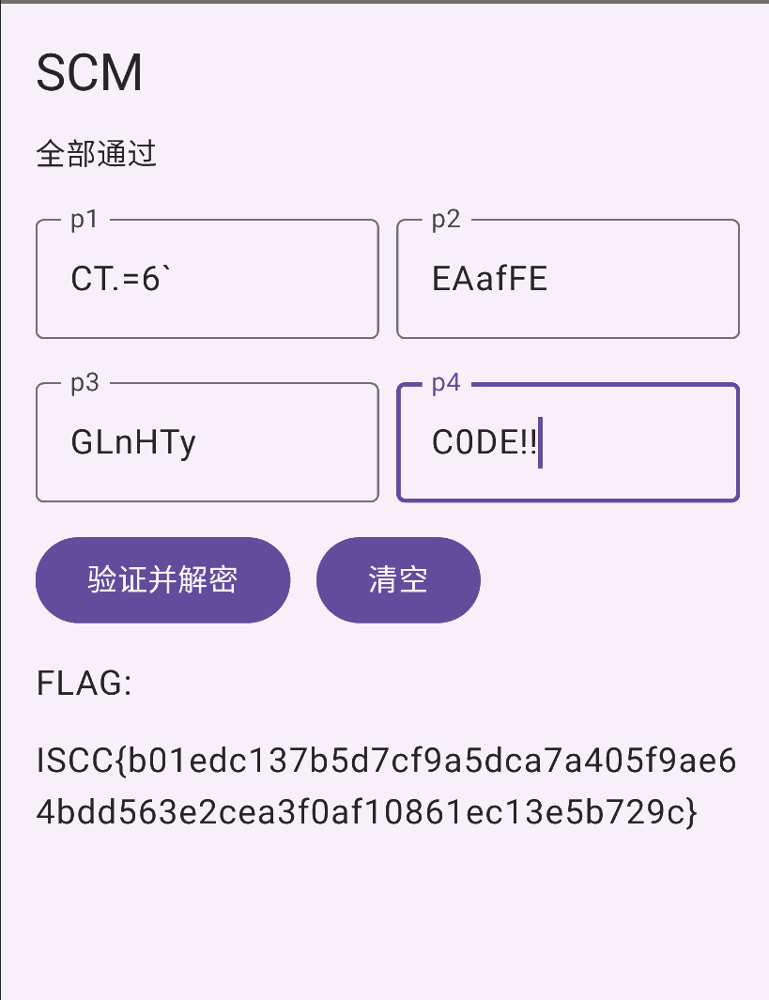

+++
title = "代号：暗箱解密行动"
date = "2026-05-06"
type = "post"
categories = ["ISCC2026"]
tags = ["ISCC2026"]
draft = false
+++
# SCM APK Writeup

## 1. `p1/p2/p3/p4` 在哪里校验

四段输入最终都会进入 `PasswordValidator.validateAndDecrypt(context, p1, p2, p3, p4)`：

- [PasswordValidator.smali](C:/Users/ericgao/Desktop/test/analysis/SCM_1.0/smali_classes4/com/example/scm/ctf/PasswordValidator.smali:126)

这一个函数就是总校验入口。它的逻辑可以概括成：

1. 先在 Java/Kotlin 层校验 `p1`
2. 再在 Java/Kotlin 层结合 `p1` 校验 `p2`
3. 调 native 校验 `p3`
4. 调 native 校验 `p4`
5. 全部通过后，用 `p1+p2+p3+p4` 拼成 key 去解密 `flag.enc`

关键调用点分别在：

- `p1` 校验主体：[PasswordValidator.smali](C:/Users/ericgao/Desktop/test/analysis/SCM_1.0/smali_classes4/com/example/scm/ctf/PasswordValidator.smali:225)
- `p2` 校验主体：[PasswordValidator.smali](C:/Users/ericgao/Desktop/test/analysis/SCM_1.0/smali_classes4/com/example/scm/ctf/PasswordValidator.smali:298)
- `p3` native 调用：[PasswordValidator.smali](C:/Users/ericgao/Desktop/test/analysis/SCM_1.0/smali_classes4/com/example/scm/ctf/PasswordValidator.smali:407)
- `p4` native 调用：[PasswordValidator.smali](C:/Users/ericgao/Desktop/test/analysis/SCM_1.0/smali_classes4/com/example/scm/ctf/PasswordValidator.smali:434)
- 最终解密：[PasswordValidator.smali](C:/Users/ericgao/Desktop/test/analysis/SCM_1.0/smali_classes4/com/example/scm/ctf/PasswordValidator.smali:491)


## 2. `p1` 怎么校验

`p1` 的硬编码目标 hash 在：

- [PasswordValidator.smali](C:/Users/ericgao/Desktop/test/analysis/SCM_1.0/smali_classes4/com/example/scm/ctf/PasswordValidator.smali:76)

值为：

```text
5475D82A7B1E7BAD1C0D50487C52AD17D8C7E5F1FF68E361ACC725CD301A5215
```

辅助函数在：

- `trimEnd()` 相关处理：[Transforms.smali](C:/Users/ericgao/Desktop/test/analysis/SCM_1.0/smali_classes4/com/example/scm/ctf/Transforms.smali:334)
- `take(6)`/长度处理：[Transforms.smali](C:/Users/ericgao/Desktop/test/analysis/SCM_1.0/smali_classes4/com/example/scm/ctf/Transforms.smali:462)
- SHA-256 相关：[Transforms.smali](C:/Users/ericgao/Desktop/test/analysis/SCM_1.0/smali_classes4/com/example/scm/ctf/Transforms.smali:542)

还原后逻辑如下：

```python
def normalize_ascii6(s: str) -> str:
    return s.rstrip()[:6]

def require_ascii6(s: str):
    assert len(s) == 6
    assert all(0x20 <= ord(c) <= 0x7E for c in s)

def double_sha256_ascii6(s: str) -> str:
    s = normalize_ascii6(s)
    require_ascii6(s)
    return sha256(sha256(s.encode("ascii"))).hexdigest().upper()

assert double_sha256_ascii6(p1) == "5475D82A7B1E7BAD1C0D50487C52AD17D8C7E5F1FF68E361ACC725CD301A5215"
```

也就是说，`p1` 本质上是一个 6 字符可打印 ASCII，经过“双 SHA-256”后与固定常量比较。


## 3. `p2` 怎么校验

`p2` 仍然在 `PasswordValidator.validateAndDecrypt()` 里完成校验：

- [PasswordValidator.smali](C:/Users/ericgao/Desktop/test/analysis/SCM_1.0/smali_classes4/com/example/scm/ctf/PasswordValidator.smali:298)
- [PasswordValidator.smali](C:/Users/ericgao/Desktop/test/analysis/SCM_1.0/smali_classes4/com/example/scm/ctf/PasswordValidator.smali:391)

用到的辅助函数包括：

- `foldAscii6ToU24`：[Transforms.smali](C:/Users/ericgao/Desktop/test/analysis/SCM_1.0/smali_classes4/com/example/scm/ctf/Transforms.smali:368)
- `hex6ToU24`：[Transforms.smali](C:/Users/ericgao/Desktop/test/analysis/SCM_1.0/smali_classes4/com/example/scm/ctf/Transforms.smali:431)
- `u24ToHex6`：[Transforms.smali](C:/Users/ericgao/Desktop/test/analysis/SCM_1.0/smali_classes4/com/example/scm/ctf/Transforms.smali:935)
- `atbashHex6`：[Transforms.smali](C:/Users/ericgao/Desktop/test/analysis/SCM_1.0/smali_classes4/com/example/scm/ctf/Transforms.smali:89)
- `rol24`：[Transforms.smali](C:/Users/ericgao/Desktop/test/analysis/SCM_1.0/smali_classes4/com/example/scm/ctf/Transforms.smali:880)

其中 `foldAscii6ToU24` 实际上是一个 24 位 FNV-1a：

```python
def fnv24(s: str) -> int:
    h = 0x811C9DC5
    for b in s.encode("ascii"):
        h ^= b
        h = (h * 0x1000193) & 0xFFFFFFFF
    return h & 0xFFFFFF
```

`p2` 的约束可整理为：

```python
u1 = fnv24(p1)
u2 = fnv24(p2)

a = (u2 ^ 0xAAAAAA) & 0xFFFFFF
b = hex6_to_u24(atbash_hex6(u24_to_hex6(a)))
c = rol24(b, 8)
want_u1 = hex6_to_u24(atbash_hex6(u24_to_hex6(c)))

assert u1 == want_u1
```

所以 `p2` 不是直接和某个常量比，而是要求 `fnv24(p2)` 经过一串 24 位变换后，能够回到 `fnv24(p1)`。


## 4. `p3` 怎么校验

Java 层入口在：

- [NativeBridge.smali](C:/Users/ericgao/Desktop/test/analysis/SCM_1.0/smali_classes4/com/example/scm/ctf/NativeBridge.smali:133)
- [NativeBridge.smali](C:/Users/ericgao/Desktop/test/analysis/SCM_1.0/smali_classes4/com/example/scm/ctf/NativeBridge.smali:198)

最终进入 native 的 `Java_com_example_scm_ctf_NativeBridge_nativeValidatePart3`。

这一段的核心逻辑是：

1. 要求 `p1/p2/p3` 都是 6 字节可打印 ASCII
2. 计算 `fnv24(p3)`
3. 令 `off = fnv24(p3) ^ 0xAAAAAA`
4. 从 `assets/data.bin` 的 `off` 位置读取 3 字节 little-endian
5. 读取值再与 `0xDEADBE` 异或
6. 结果必须等于 `(xor6(p1) << 16) | (xor6(p2) << 8) | xor6(p3)`

抽象成代码就是：

```python
def xor6(s: str) -> int:
    x = 0
    for b in s.encode("ascii"):
        x ^= b
    return x & 0xFF

off = fnv24(p3) ^ 0xAAAAAA
v = read_u24_le(data_bin, off)
left = (v ^ 0xDEADBE) & 0xFFFFFF
right = (xor6(p1) << 16) | (xor6(p2) << 8) | xor6(p3)
assert left == right
```

这里最关键的外部资源是：

- [data.bin](C:/Users/ericgao/Desktop/test/analysis/SCM_1.0/assets/data.bin)


## 5. `p4` 怎么校验

Java 层入口在：

- [NativeBridge.smali](C:/Users/ericgao/Desktop/test/analysis/SCM_1.0/smali_classes4/com/example/scm/ctf/NativeBridge.smali:205)
- [NativeBridge.smali](C:/Users/ericgao/Desktop/test/analysis/SCM_1.0/smali_classes4/com/example/scm/ctf/NativeBridge.smali:270)

最终进入 native 的 `Java_com_example_scm_ctf_NativeBridge_nativeValidatePart4`。

这一段不是普通 hash 比较。它先计算一个 24 位 `seed`：

```python
seed = fnv24(p1) ^ rol24(fnv24(p2), 3) ^ rol24(fnv24(p3), 7)
seed &= 0xFFFFFF
```

然后将 `p4` 经过一个“旋转 Base64 表 + 位混淆”编码，结果必须命中 native 里的硬编码目标：

```text
gGH52dkV
```

抽象后可写成：

```python
B64 = b"ABCDEFGHIJKLMNOPQRSTUVWXYZabcdefghijklmnopqrstuvwxyz0123456789+/"
TARGET = b"gGH52dkV"

def encode_p4(p4: bytes, seed: int) -> bytes:
    rot = B64[seed & 0x3F:] + B64[:seed & 0x3F]
    v1 = (p4[0] << 16) | (p4[1] << 8) | p4[2]
    v2 = (p4[3] << 16) | (p4[4] << 8) | p4[5]
    sext = [
        (v1 >> 18) & 0x3F, (v1 >> 12) & 0x3F, (v1 >> 6) & 0x3F, v1 & 0x3F,
        (v2 >> 18) & 0x3F, (v2 >> 12) & 0x3F, (v2 >> 6) & 0x3F, v2 & 0x3F,
    ]
    out = []
    for i, s in enumerate(sext):
        mix = (seed >> ((i * 7) % 24)) & 0x3F
        out.append(rot[(s ^ mix) & 0x3F])
    return bytes(out)

assert encode_p4(p4.encode("ascii"), seed) == b"gGH52dkV"
```


## 6. 图片提示怎么用

APK 自带了一张提示图：

- 资源位置：[p1_display.png](C:/Users/ericgao/Desktop/test/analysis/SCM_1.0/assets/p1_display.png)

原图如下：


把它重组后，可以得到你给的提示图：

- 重组图：[d95d0da37387484ca79aed460c35b4bf.png](C:/Users/ericgao/AppData/Local/Temp/d95d0da37387484ca79aed460c35b4bf.png)


从图上最直观能读出的内容是：

```text
43542E303660
```

但这个值不能直接当作 `p1`，原因有两个：

1. `p1` 校验只接受 6 字符 ASCII，不接受 12 位 hex 串直接输入
2. 如果把 `43542E303660` 直接按 hex 转 ASCII，会得到 `CT.06``，代入双 SHA-256 后对不上硬编码 hash

因此，提示图的正确用法不是“直接抄字符串”，而是把它理解成：

1. 这张图给的是 `p1` 的 hex 形式提示
2. 图像重组/识别过程中有一位被误读
3. 把 `43542E303660` 修正为 `43542E3D3660` 后，才能命中程序校验

也就是：

```text
43 54 2E 3D 36 60
 C  T  .  =  6  `
```

因此：

```text
p1 = CT.=6`
```

这一点最终要靠程序校验来反证。也就是说，图片只负责给方向，真正定值还是靠 `p1` 的双 SHA-256 比较来确认。


## 7. 怎么解出 `p1/p2/p3/p4`

### 7.1 解 `p1`

先从提示图出发，得到重组后的 hex 提示。将其修正为：

```text
43542E3D3660
```

再转 ASCII：

```text
p1 = CT.=6`
```

把它代回 `p1` 的双 SHA-256 校验，正好命中目标 hash：

```text
5475D82A7B1E7BAD1C0D50487C52AD17D8C7E5F1FF68E361ACC725CD301A5215
```

所以：

```text
p1 = CT.=6`
```

### 7.2 解 `p2`

有了 `p1` 之后，先算：

```python
u1 = fnv24(p1)
```

把 `p2` 的变换链反推，可得到它应满足：

```text
fnv24(p2) = 0xEFAF45
```

接下来在 6 位可打印 ASCII 里找这个 FNV-1a 24 位前像即可。最终可得：

```text
p2 = EAafFE
```

### 7.3 解 `p3`

已知 `p1` 和 `p2` 后，`p3` 需要同时满足：

1. `fnv24(p3)` 决定 `data.bin` 中的取值偏移
2. 读出的 3 字节经过异或后，要与 `xor6(p1) / xor6(p2) / xor6(p3)` 拼起来的值相等

联立这一约束并筛选后，得到：

```text
p3 = GLnHTy
```

### 7.4 解 `p4`

已知 `p1/p2/p3` 后，`seed` 就固定了：

```python
seed = fnv24(p1) ^ rol24(fnv24(p2), 3) ^ rol24(fnv24(p3), 7)
```

接着反推 native 中的编码目标 `gGH52dkV`，得到：

```text
p4 = C0DE!!
```


## 8. 最终结果

四段输入分别为：

```text
p1 = CT.=6`
p2 = EAafFE
p3 = GLnHTy
p4 = C0DE!!
```

程序最终使用：

```text
key = p1 + p2 + p3 + p4
```

去解密：

- [flag.enc](C:/Users/ericgao/Desktop/test/analysis/SCM_1.0/assets/flag.enc)

得到最终 flag：

```text
ISCC{b01edc137b5d7cf9a5dca7a405f9ae64bdd563e2cea3f0af10861ec13e5b729c}
```


## 附件下载

- [attachment-7.apk](attachment-7.apk)
- [Pasted image 20260506190543.png](pasted-image-20260506190543-2.png)

