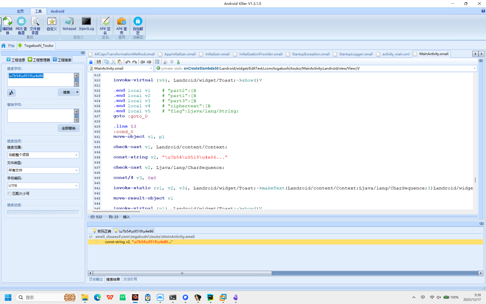
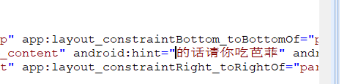

+++
title = "crakemeup"
date = "2026-01-22"
type = "post"
categories = ["Reverse"]
tags = ["Reverse"]
draft = false
+++
找“答错了”\u7b54\u9519\u4e86

输入与generatePassword()生成的密码比较
正确密码 = 设备 ID（Build.ID） +  “touko_secret_salt”
然后UTF-8 编码后计算 MD5 哈希
再转十六进制字符串并截取前 8 位
这个8位的应该就是要输入的

或者说直接hook一下
调试

上面的当我没说
搜”答错了“的unicode找到
Mainactivity
这个里面有一个判断
只要把判断改了就行
叫checkpassword
结果异或一下
xor v1 v1

安装到模拟器里应该就能用了
改一下字符方便看出到底改没改

