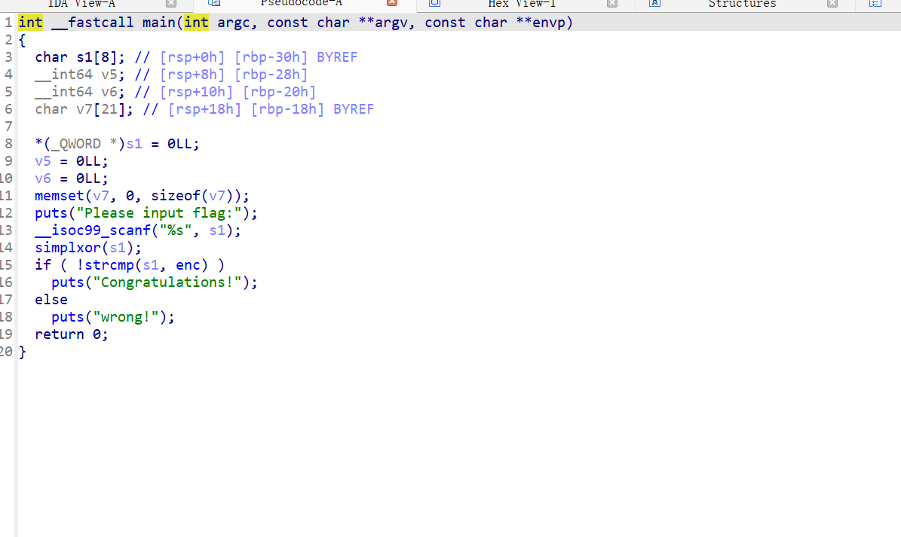
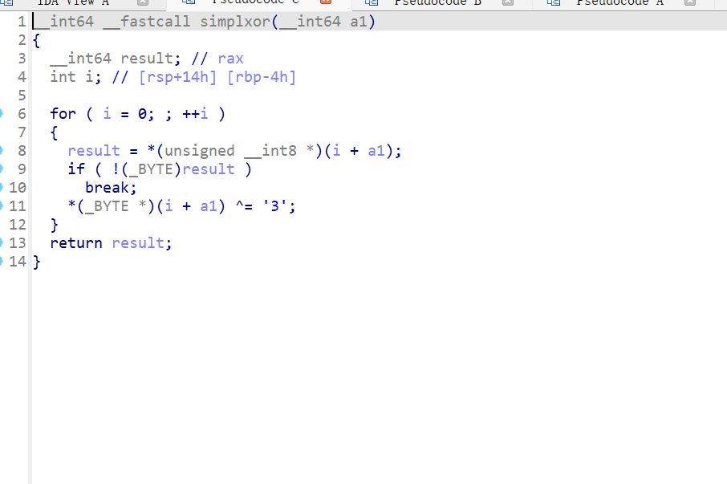
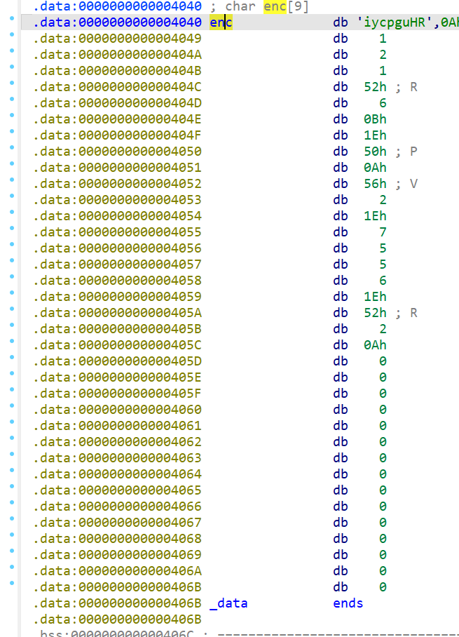

+++
title = "ezxor"
date = "2026-01-22"
type = "post"
categories = ["Reverse"]
tags = ["Reverse"]
draft = false
+++

做了一个异或

上面是旧的
下面是新的
enc=
0x69, 0x79, 0x63, 0x70, 0x67, 0x75, 0x48, 0x52, 0x0A, 0x01, 0x02, 0x01, 0x52, 0x06, 0x0B, 0x1E, 0x50, 0x0A, 0x56, 0x02, 0x1E, 0x07, 0x05, 0x05, 0x06, 0x1E, 0x52, 0x02, 0x0A, 0x00, 0x1E, 0x52, 0x55, 0x05, 0x0B, 0x02, 0x07, 0x0A, 0x56, 0x0B, 0x55, 0x55, 0x01, 0x4E

写脚本
答案ZJPCTF{a9212a58-c9e1-4665-a193-af68149e8ff2}
