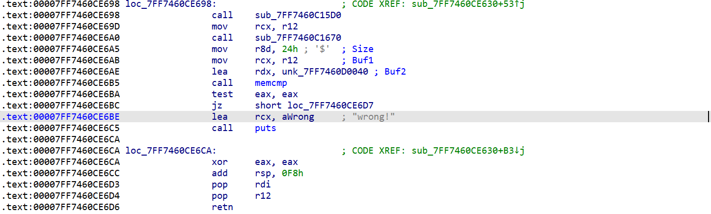
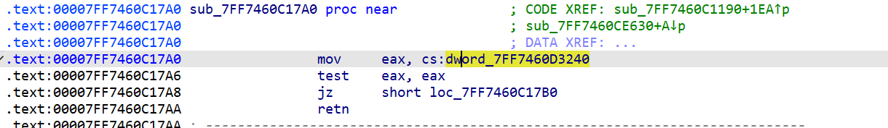
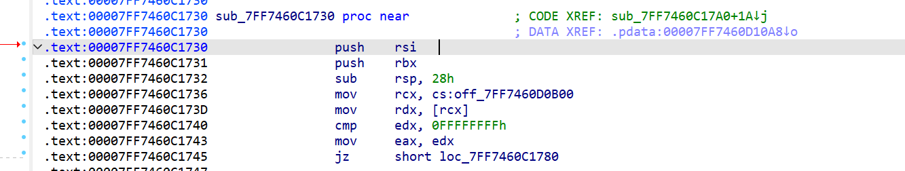
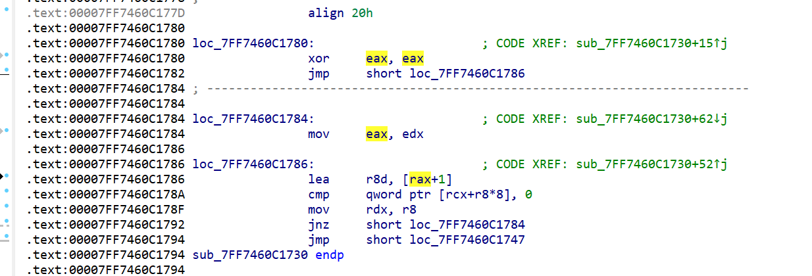
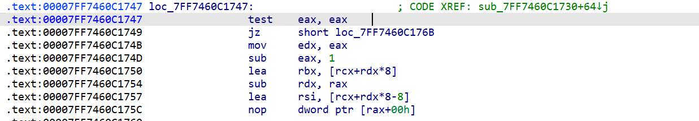
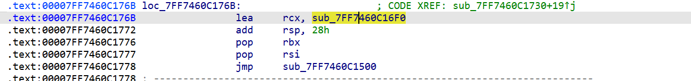
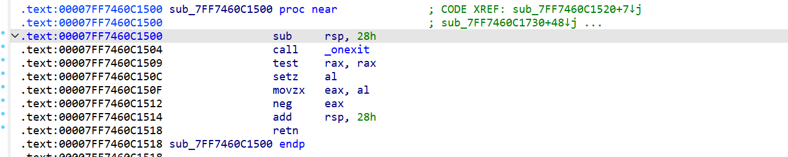
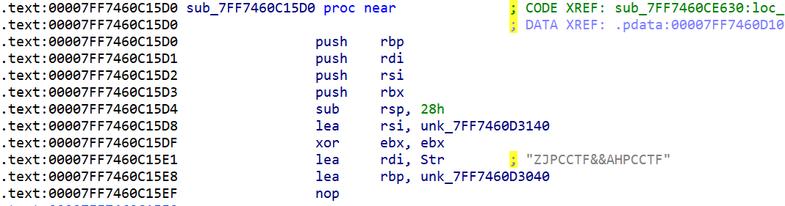
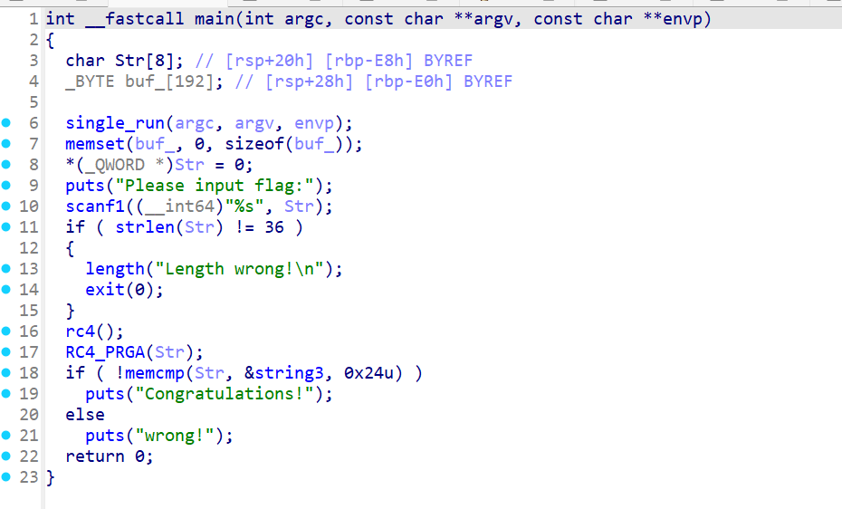
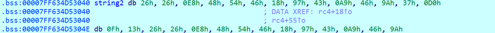

+++
title = "rc4"
date = "2026-01-22"
type = "post"
categories = ["Reverse"]
tags = ["Reverse"]
draft = false
+++
这是判断
上面还有一个长度的判断
要36位的flag

找到一个东西       ZJPCCTF&&AHPCCTF

像密钥？
将sub_7FF7460CE630()命名为main
开始改函数名附件到时候看看能不能扔文件夹里
string3
hex=46A02ADF2AAA76C0E59F25E3EB375065568CEAE188BF06D48F3F873737E72E0E6E52452D
这个没问题，运行也不会动
key=（错了）
[
    0xAB,0xEF,0x92,0x80,0x85,0xD7,0xD7,0xC0,
    0x7B,0x9C,0x16,0x65,0xC1,0x6E,0xE7,0x0E,
    0xBB,0xCF,0x6B,0xF6,0xAE,0x79,0xB1,0x0E,
    0xD1,0xD3,0x80,0x7F,0xD0,0x87,0xD9,0xCF,
    0xB2,0xA9,0xAF,0xE6
]
运行的时候key不是这个
而是以下的
取到13h为止
26 26 E8 48 54 46 18 97 43 A9 46 9A 37 D0 0F 13
以这个作为key
扒一个脚本
再次解密
ZJPCTF{aTTr1b5te_C0nst7uct@r_in_rc4}
